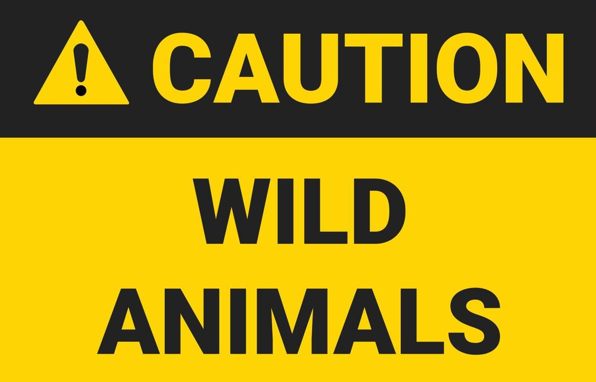

## Introduction

iNaturalist is a platform that is designed to allow collection, identification and organization of biological organisms from amateur observations. Meaning anyone can upload a photo or audio of a plant or animal they observed for anyone to identify its species. Certain information is really helpful when uploading photos, like geographical location, date of observation and status of the specimen (such as alive or dead). Identified observations are then added to collections for different projects, this could range from collections from the region to showcase local flora and fauna in for instance a local forest, natural reserve, or even campus premises of school, they could also be related to academic projects with biological or ecological relevance for instance the presence or absence of a species in a region over a defined period of time, interactions between organisms such as plants and birds or a record of the distribution of a species for future sample collections.

iNaturalista has several measures to protect the privacy of their users and in fact does not require personal information at any point, it has no social media aspect and it's heavily moderated.

Please check the following link to verify the platform.
<https://mexico.inaturalist.org/>

## Objective

The purpose of this activity is to allow students to interact with the platform to upload their own observations, have them identified and "cured" by themselves (manual verification of the identification through literature), lastly getting familiarized with ecological concepts of the identified species displayed on the platform and its user interphase will be helpful as an introduction to scientific repositories.

## Methodology

The following methodology will be separated in stages to help reduce overload during the last partial. Students should focus on fulfilling stage 1 of their work before the end of block 3 which will be at the end of May and advancing with the rest of the stages as much as possible before the beginning of the third partial.

### Stage 1 Collecting Observations

iNaturalist allows photos and audio. Video can be uploaded and will be converted to audio automatically. Entries will require some basic information regarding **LOCATION** and **DATE** so make sure to collect this information. Exact location can be obscured or set up to private in entries by the platform for several reasons including safety so don't be afraid to register coordinates.

**DO NOT UPLOAD PHOTOS THAT INCLUDE A PERSON'S FACE! they will be removed.**

##### Photographic evidence of organisms

Organisms should be photographed with as much detail as possible, photographs with long distance lenses are recommended but modern phone cameras allow us to zoom in on animals that might flee when approached. Other organisms may allow us to photograph from closer distances but proceed with caution if they are venomous. Plants are usually safe to photograph but there are multiple photos one needs to take to have all required information for them to be identified. Corpses of animals may be infectious so it's recommended to avoid direct handling of them if you are still interested in making an observation try to wear gloves and wash your hands.

\##### Photographing animal evidence
The following types of photographs are allowed on the platform.

- Photos of the living animal itself
- Corpse or skeleton of an animal (Skulls are particularly helpful)
- Footprints
- Fecal matter
- Eggs
- Cocoons
- Molted skins or exoskeletons

It should be noticed that identification of an animal can be straightforward or complicated, for instance some reptiles like snakes or insects require to be mature to develop the adult characteristics that allow it to be identified. Some snakes have different scale patterns on their head that are the only difference between species. Always try to capture as much detail as possible keeping safety in mind.

<figure>

<figcaption aria-hidden="true">458x357</figcaption>
</figure>

Footprints and feces of animals are very helpful as evidence of presence but it is adviced to place an element to be able to determine their size, a ruler is optimal but anything which can later be used to measure it comparatively is useful as well, for instance a pen.

\##### Photographing plant evidence
Students are encouraged to photograph plants as well as animals, they are easy to photograph since they don't move but one does need to be careful with capturing enough information in the photos, to allow for identification, it is recommended to take photos of all possible characteristics from the following list:

- Photos that show the whole plant
- Bark of the plant
- Leafs
- Flowers
- Fruits or cones
- Dried up plants/Dead specimens
- Branching pattern
- Budding pattern

Examples of features that will help identify species:

Plants in our state and city that are poisonous are rare but it is adviced to research information about local poisonous plants if you will be traveling outside of the city.
\##### Taking audio evidence
You may upload audio directly or a video that will be converted to audio automatically this is specially good for species that have very unique singing patterns such as monkeys, toads, lizards, squirrels and birds.

Example of an animal singing pattern:

<audio
src="iNaturalist-media/ccfc2436d326395abd812c0c7ab6c4654d726284.wav"
class="wikilink" controls=""><a
href="iNaturalist-media/ccfc2436d326395abd812c0c7ab6c4654d726284.wav">birdsong2.wav</a></audio>
\### Stage 2 Uploading your observations

##### How to login

Students have two options to interact with iNaturalista, they can either download the app or they can directly login on the website through the following link:

https://mexico.inaturalist.org/

Even when choosing the app, make sure to check the website to obtain the proper link for your phone's app store, **DO NOT confuse the app iSeek with iNaturalista.**

You may login to your class account through the following user information:

If you belong to class 4A-BB

[Terms and Conditions](https://www.inaturalist.org/pages/terms)

[Community Guidelines](https://www.inaturalist.org/pages/community+guidelines)

Note: Students that wish to become active members of the iNaturalista community may create their own user with their personal email if they choose to as long as they are over the age of 13 since, however for the purposes of this activity we will use shared accounts.
\##### How to upload files to register an observation
Students should upload their photographs for a single organism as individual entries, this will allow someone else to classify them, if a student is familiar with the taxonomic category they should select it within their knowledge. For instance selecting **INSECTA** for something they believe is an insect even if they don't know the species, genus or family.

##### Instructions to upload

In order to upload an observation as an entry please follow the following steps which will be given for the website version of the platform. In general the user interphase is very intuitive but you are encouraged to read this section of the guide to get a basic idea of the process before you upload anything.

Click on **Cargar** on the top right corner to bring up the upload menu.

You may drag your files if you are on a computer or you may click **Selecciona archivos** to bring up the file explorer menu on your device, browse to the folder containing your photo, audio file or video (which will be converted to audio) and select them. You may upload more than 1 file per observation as long as it's from the same organism. Once you upload the files you should see a preview that looks like the following image.

Click on **Nombre de las especies** to select an identification of your own, the website has image AI and is usually able to determine at least the broad taxa of the species up until the family or genus category, for instance in the given example the AI suggests the genus *Camaleones o Lagartijas Cornudas Genero Phrynosoma* as well as two different species, since we don't really know the species yet let's just select the genus is suggesting. If this happened to be wrong we can always correct it so it's not a big issue.

Click on **Fecha** to select the date the observation took place.

Click on **Ubicación** to select the place the observation took place, there are a few tricks to do this but the easiest one is to manually type the name of the city or region on the left corner. You should see a big circle, this means that the coordinates are not being precise.

<figure>

<figcaption aria-hidden="true">398x334</figcaption>
</figure>

If you wish and are able to register a more precise location you may either click the approximate location to generate a smaller and more precise circle around the selected spot.

There aren't usually many situations when one would require privacy with geo-location and these types of observations, most photos do not show property, photos that have human faces are not allowed on the platform and our accounts do not contain personal information, despite this, we wish to be on the safe side so we will use 2 points as guidelines for good practices:

1.  Searching for City as a place is more than enough information to pinpoint a location and **will be allowed**, for instance selecting "Bahia de Kino" or "Hermosillo" is precise enough.

2.  If you wish to be more precise, make sure that **Precisión (metros)** never goes below 2000 meters (going over it is allowed). This is more than enough for most projects and still wide enough to protect anyone's privacy. You may find the precision below the map next to the latitude and altitude section.

**Entries that break guideline 2 will be modified by the teacher to fulfill it.**

There are other privacy options when uploading entries and the website even does some of them automatically, you are welcomed to explore other options and discuss any privacy concerns you may have with your teacher, if you still have privacy concerns for whatever reason then please do not upload that specific observation and discuss it with your teacher.

You may also register notes in the **Notas** section, for instance the approximate time of the day when the photo was taken, behavior of the animal, state of decay, signs of predation, signs of contaminants in the area, or interaction with other organisms i.e. a bird eating fruits from a sahuaro cacti.

Once you have filled out all the information click on the green button **submit observation** on the top right corner.

### Stage 3 Manual Verification of Identifications

##### What are we doing again?

Students should remember that the goal of identifying an observation is to find the correct rank at the species level, this may not be possible every time so we should also recognize that the genus rank (although a more humble identification) still holds valuable data if for one reason or another we fail to identify an observation down to the species rank. The purpose of this section is to make sure that we can provide some useful information to the platform, therefore we need to make sure the information we are providing is correct.

\##### The aftermath of uploading an observation
After uploading an observation you may expect an identification (ID) by another user in less than 24 hours. Typically an entry receives 2-3 ID's, specially if the species is easy to identify or a common sight. Upon leaving your **Home** page for a few days a user will notice there will be a couple of messages, the first type of message will be ID's from other users which will be the main focus of this activity and this guide, see an example below:

You will notice there is now a species being suggested as an ID for our observation in this case Regal Horned Lizard (*Phyrnosoma solare*), if we click the button **Agree** we would be labeling our observation with the species we mentioned, if we later decide this initial agreement is wrong we can still correct it later on, for now let's pause and not click anything to verify if we can find some documentation on the species.

Clicking on the word for the species **Regal horned Lizard** will send us to a page with a summary of the species.

if we select the option **view more** on the photo section we can begin to see the similarities between our observation and the species being suggested.

This is a good start and likely means that the suggested ID is correct, we should still be careful since it's almost never easy to identify a species, so before we agree to the given ID let's do some quick searches for information which may help us. Like previously mentioned, iNaturalista, wikipedia and other resources are helpful, iNaturalista will allow us to see what people think these species looks like but it's better to have a secondary source, a quick google search provides several resources for this species, an interesting one is indexed in this repository which I recommend browsing through because it contains papers (scientific publications) on both flora and fauna from Sonora.

http://wildsonora.com/

In this article we can find a quick summary of the eight species of the genus *Phyrnosoma* in our state.

After going through the article, reading about the distribution of the species and comparing our observation with the other 7 species it seems that our species has a very different horn morphology so it's relatively easy to give an ID, it seems that our species is indeed properly identified as *Phyrnosoma solare*.

It's possible and likely that some species will be harder to identify due to the lack of easy accessible reading material, sometimes it's not clear what the difference between two species is to us as non-experts on the field, sometimes it's even impossible. In those scenarios we are going to try to be humble in our ID and not accept the species identification, but if we do believe the genus is correct then we may propose a genus without a specific species. Once again, I recommend approaching your teacher to get a second opinion.

In this case we are going to select **Agree** to accept the ID.

After agreeing to the ID, we will be taken to our observation summary page where we can see all other suggestions for ID's, you will notice there is an ID Withdrawn from ourselves, which was our initial broad classification of the species. In our previous example this was the genus *Phyrnosoma*, in the example below (a different observation) I suggested an initial ID as *Squamata* which is an **order** instead of a **genus** an even broader category. This is an ID and has been withdrawn because of a more specific ID being given *Phyrnosoma solare*.

\##### On learning to disagree with others
Students should verify the classification of a species using all available information to them, if the student has a legitimate reason to disagree with the given identification they should give a correction and explain their reasoning. Some users are hasty to give identifications and although they are not a majority, students should still be cautious and verify every identification down to the species level to avoid incorrect ID's (family and genus level identifications are less likely to be incorrect.)
\##### Examples of disagreements
A few years ago I uploaded an entry from a baby snake I saw inside of a natural reserve, hours later a user proposed an ID which was *Species A*. Upon looking at the geographical distribution of the species I noticed *Species A* was not found in the area my observation took place (this would be akin to seeing polar bears in the desert). Since the natural reserve where this observation took place is very well documented a guide of fauna was available, after searching for *Species A* in the guide I confirmed that *Species A* was not present in the area and so the ID for my observation as *Species A* was if not impossible, unlikely.

Furthermore differentiating between species of snakes is complicated and requires photos of the scale pattern located in the top of the head, side coloration patterns are also required to properly identify the species, both photos were not available, demonstrating that the given identification was not only incorrect but hastily given. Fortunately the guide contained a list of all available snakes found in the area which revealed *Species B* to be the only possible identification.

The guidelines of the community encourage scientific disagreement as long as it remains civil. In the case of a disagreement a user may issue an identification correction and explain their reasoning, in this specific scenario the comment should look something like this:

> \[!NOTE\] Correction Species A -\> Species B
> Species A is not located in this area, characteristic pattern of head scales and stripes for Species A isn't visible. Species B is the only snake available in the area that matches other criteria according to local guide, therefore ID is corrected to Species B.
> \##### On controversial identifications
> After a correction has been made some disagreement may or may not arise, users that have elaborated proper corrections are extremely unlikely to receive further commentary (In fact commentary is rare in this platform) however if a correction you made seems to be controversial PLEASE refer to your teacher to discuss it in class and use it as a learning experience for everyone.
> \##### On the importance of projects
> Upon getting an ID or ID suggestion we can also recieve messages from **curators** in our **Home** page, in the following image you will see that **Aves de México** has added our observation to a project somewhere else, you may also notice that there is a green flag that says **Research Grade** on our observation. Typically curators will wait for an observation to have this label before they add anything to a project but if the project doesn't require an ID they may add it anyway.
>  src="iNaturalist-media/495ab18b066062ed3be1d27610792086848610c7.png"
> class="wikilink" alt="521x158" />
> This particular project is huge and has over 2 million observations with 1701 species as you can see from the stats pages on their project page. You may access a project by interacting with the project name.
>  src="iNaturalist-media/b6523c04d96a268fac7bf93f2f0663361568537f.png"
> class="wikilink" alt="527x263" />
> Projects curated manually by other persons allow scientists and amateurs alike to gather tons of information for studies, for instance in the project section on **Aves de México** we can go to **Export Observations**and access a filter query which will allow us to do a broader or specific search to fulfil our purposes. I.e. a user may filter a specific bird species being observed in a specific season through several years and determine if the abundance of that species has decreased.

**For the purposes of this activity we won't dive into projects and what we can do with them,** but I strongly suggest any person that has an interest in biology, conservation or even photography to take a look at them. If you are in need for a place to get data to develop a personal project this is an amazing source.

### Stage 4 Report

Students should select a single species from the ones that they observed which they find interesting and use it to fulfill the next sections, you may use your own photos of the species or photos from other observers in iNaturalista but make sure to give credit to person that took the photo, remember that selecting the name of the species in the **Home** page will send you to the species summary page, this contains most of the information you require to make the following report.

##### Written Report

Based on your selected species please write a report that goes over the following points:

***Species Report***

**Taxonomy**:
- List the full classification: Kingdom, Phylum, Class, Order, Family, Genus, Species

**General characteristics**
- Describe the physical appearance (size, color, distinctive features)
- Mention behaviors or sounds (if applicable)
- Include when and where it's commonly seen
- Insert your **own observation photo** from iNaturalista and a reference photo from a second source

**Special Attributes**
- Describe **any interesting traits** that make this species stand out:
- Adaptations to the environment
- Defense mechanisms (i.e. camouflage, toxins)
- Unusual feeding habits or reproductive behaviors
- Cultural or symbolic significance (if any)

**Geographical Distribution and Habitat**
- Where is this species naturally found?
- Include the **distribution map** from iNaturalista
- Note if it's **endemic** or found globally
- Describe the type of habitat it prefers
- Climate, vegetation, altitude, water sources, etc.

**Conservation Status**
- Is this species at risk? (iNaturalista has this information)
- List the main **threats** to its survival
- Mention any **conservation efforts** or legal protections
- If not endangered, explain why it's considered stable

**Ecological Relevance of the Species**
- Explain the species' role in the **ecosystem**:
- Is it a keystone species, pollinator, decomposer, etc.?
- Mention **interactions** with other species (predators, prey, symbiosis)
- What would happen if this species disappeared?

***Format requirements***
- **Length**: Minimum **2 pages** (excluding images and references), I expect length to be around 3-4 pages.
- **Font**: Times New Roman or Arial, **12 pt**, **1.5 line spacing**
- **Margins**: Standard 1-inch margins
- **Cover Page**: Include the following:
- Project title: *iNaturalista Species Report*
- Students FULL NAMES
- School name
- Biology II
- Date
- Scientific name of the species observed (in italic)
- **Images**: At least **2 images** (one must be your own observation from iNaturalista)
- **References**: Cited at the end (APA)
- **Format**: Save this document in .pdf or .docx

##### Poster

Students should also use the written report as basis for a poster, the following points are mandatory:

1.  Scientific name of the species along with the common name.
2.  Taxonomy
3.  General characteristics (defining features)
4.  Distribution and habitat
5.  Conservation status and efforts
6.  Ecological relevance of the species
7.  References
8.  Leave room for an additional section in which you may detail anything interesting about the species, this can be something in their morphology, a survival strategy or a historical event associated with them, don't limit your imagination in this section.

The following poster is an example of what a poster should look like, for obvious reasons this is an unfinished template.

\##### Video Report
Students should select a species from their entries/observations that they like or think it's interesting and make a video with the following format:

1.  Scientific name of the species, taxonomical classification
2.  Key features and how to identify it
3.  Distribution and habitat
4.  Special attributes
5.  Conservation status
6.  Ecological relevance of the species

While discussing the points use images to make your video more interesting, such as a map of the distribution or images of the species itself, if possible be near a specimen when recording this video. You may also use your poster. Here's an example of a script that touches every point.

> \[!Example script for a video\]
> *Canis lupus baileyi* more commonly known as the mexican wolf is a species related to other wolfs of the genus *Canis* and famously related to the modern dog, one can distinguish *Canis lupus baileyi* from other wolfs by its smaller narrow skull and overall smaller size. It's native to North-America it's original distribution included Sonora, Chihuaha, Arizona, New Mexico and Texas mostly keeping close to the habitat given by the Madrean woodlands of the Sierra Madre Occidental close to it's main prey the white tailed deer. The mexican wolf was hunted down almost to extinction by farmers and cattle owners and its conservation status of **Endangered** reflects this. Currently there are less than 300 wolves living in the wild, fortunately the Mexican Wolf Recovery Plan has made significant efforts to repopulate its original habitat. Biologists have suggested that despite the unpopular reintroduction programs top predators are highly beneficial to an ecosystem since they predate smaller animals specially invasive ones who would normally out-compete less abundant native species.

Not all members of the team require to appear in the video report.

## References

**1. Breen, A. (2015, May 29).** *Taxonomic rank graph Vulpes vulpes* \[SVG image\]. Wikimedia Commons.
<https://commons.wikimedia.org/wiki/File:Taxonomic_Rank_Graph.svg>

**2. Stovall, G. (2013, December 18).** *Pine tree identification key* \[Web page\]. PulpBits. <https://pulpbits.net/4-pine-tree-identification-key/pine-tree-identification-guide/>

**3. Cope, E. A. (2000, November 28).** *Summer and winter keys* \[Web page\]. Cornell University. [http://bhort.bh.cornell.edu/tree/keys.ht](http://bhort.bh.cornell.edu/tree/keys.htm)
